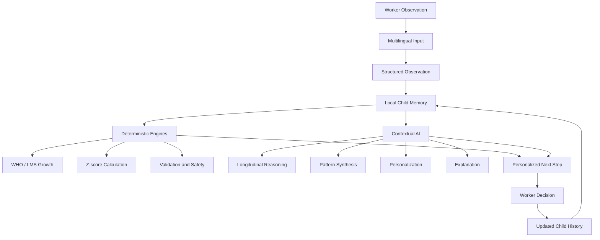

# BALAMITRA

### Understand every child. Know what to do next.

BALAMITRA is an offline-first AI assistant for Anganwadi workers, designed to make everyday child monitoring simpler, more connected and more useful.

The idea started with a simple observation: Anganwadi workers already know a lot about the children they work with. They observe them, track their growth, conduct activities, interact with families and maintain records every day. The difficulty is keeping all of that information organized and useful over time.

BALAMITRA helps bring those observations together, understand them in context and turn them into practical next steps.

---

## Why we built BALAMITRA

As part of our design process, we visited an Anganwadi centre in Hyderabad and spoke with an Anganwadi worker about her day-to-day workflow.

We found that workers deal with:

- Registering and maintaining records for many children
- Recording height, weight and other observations
- Tracking nutrition and developmental information
- Conducting activities using books and reference material
- Following up on children based on their observations
- Managing information spread across different records and tools

The problem was not a lack of information or effort.

It was the amount of information the worker has to **record, remember and connect**.

We wanted to build something that supports that work rather than adding another system for the worker to maintain.

> **The worker knows the child. BALAMITRA remembers the journey.**

---

# What BALAMITRA does

## 1. Voice-based observations

Workers can record observations through voice in:

**Telugu | Hindi | English**

Instead of filling out another form, the worker can describe what she observed naturally.

The voice input is processed and converted into structured information that can be stored against the child's profile and used by the rest of the system.

---

## 2. One continuous child history

BALAMITRA brings relevant information about a child into one place.

A child's profile can contain:

- Child information
- Growth observations
- Nutrition observations
- Developmental observations
- Activities and activity attempts
- Activity outcomes
- Available materials
- Worker feedback

This allows the system to consider what has happened previously instead of treating every new observation as an isolated entry.

---

## 3. Connect the Dots

One of BALAMITRA's core features is longitudinal reasoning.

A single observation can be difficult to interpret without context.

BALAMITRA can look across a child's history and connect relevant information from different observations and activities.

Instead of asking only:

> "What happened today?"

the system can consider:

> "What has changed over time, what happened before, and what should we consider next?"

The purpose is not to diagnose a child. It is to help the worker notice patterns and supporting evidence that may otherwise be difficult to see across separate records.

---

## 4. Context-aware AI

BALAMITRA uses a hybrid intelligence architecture.

We do not use a language model for everything.

Deterministic components handle tasks where predictable and reproducible behaviour is important, including:

- Data validation
- Safety constraints
- Structured processing
- WHO-based growth calculations
- Z-score computation
- Age and activity constraints

The contextual AI layer is used for tasks that require interpretation, including:

- Multilingual understanding
- Longitudinal context synthesis
- Pattern interpretation
- Natural-language explanations
- Activity personalization
- Parent-friendly communication

The design principle is:

> **Use deterministic methods where correctness matters, AI where interpretation matters, and keep the worker in control of the decision.**

---


                  
        +


Running the Project

Requirements

Android Studio Ladybug or newer

Android SDK Platform 35

JDK 17 or newer


Clone the repository

git clone https://github.com/nithyahasinialle-rgb/Balamitra.git
cd Balamitra

Build the application

./gradlew assembleDebug --no-daemon

The debug APK will be generated at:

app/build/outputs/apk/debug/app-debug.apk


---

Our Design Approach

BALAMITRA was not designed by starting with an AI model and looking for somewhere to put it.

We started with the worker.

We visited an Anganwadi centre, spoke with the worker, understood the workflow, identified where information was getting lost or repeated, and then designed the system around those observations.

That process influenced everything from the voice-first interaction to the longitudinal child profile and the worker-controlled recommendation loop.

Our team works across AI/ML, embedded systems, IoT, hardware and software, with experience working on AI/ML and systems projects at IIT Bombay and IIIT Hyderabad.

For us, the interesting part of BALAMITRA is the combination of design thinking and engineering.

We ask two questions together:

> Will this actually help the person using it?


and

> Can we build the technology well enough to make that possible?


BALAMITRA is our attempt to answer both.


---

The Idea Behind BALAMITRA

An Anganwadi worker sees hundreds of small pieces of information about a child over time.

A meal missed.

A new word learned.

An activity that worked.

A behaviour that changed.

A measurement that moved.

Individually, these may look like small observations.

Together, they tell a story.

BALAMITRA is built to help make that story easier to remember, connect and act on.

> The worker knows the child.
BALAMITRA remembers the journey.


---

## Longitudinal Reasoning

BALAMITRA works with information collected across multiple observations instead of treating every observation independently.

For two measurements, the system can calculate the change in weight:

**ΔW = W₂ − W₁**

It can also normalize the change over time to obtain a monthly weight velocity:

**Vw = ((W₂ − W₁) / (t₂ − t₁)) × 30**

Similarly, height velocity can be calculated as:

**Vh = ((H₂ − H₁) / (t₂ − t₁)) × 30**

These values become part of the child's longitudinal context and can be considered alongside growth, nutrition, development and activity history.

The goal is not to make a decision from a single measurement. It is to help the system understand how observations relate to what has happened previously.

---

## Personalized Activities

BALAMITRA does not simply display a fixed list of activities.

The personalization layer considers the context available for the child and the centre, including:

- Child age
- Current observations
- Previous child history
- Previous activities
- Activity outcomes
- Available materials
- Worker feedback

This allows an activity recommendation to be adapted to the child and the environment in which it will actually be used.

The worker remains in control of the recommendation:

**DO | CHANGE | SKIP**

The worker's decision and the outcome of the activity can then become part of the child's continuing history.

This creates a feedback loop:

```text
OBSERVE
   ↓
UNDERSTAND
   ↓
REMEMBER
   ↓
CONNECT THE DOTS
   ↓
RECOMMEND
   ↓
WORKER DECIDES
   ↓
RE-OBSERVE
   ↺
```

---

## How the Intelligence Works

BALAMITRA uses a hybrid architecture rather than relying on a language model for every task.



The deterministic layer handles tasks where predictable and reproducible behaviour is important, such as calculations, validation and safety constraints.

The contextual AI layer is used for tasks that require interpretation, synthesis and natural-language reasoning.

The worker remains the final decision-maker.

---

## Core AI Context

BALAMITRA does not treat the current observation as an isolated prompt.

The reasoning layer can use multiple pieces of context:

| Context | Examples |
|---|---|
| Current observation | What the worker observed today |
| Child history | Previous observations and records |
| Growth information | Measurements and calculated indicators |
| Development | Previous developmental observations |
| Activity history | Activities attempted and their outcomes |
| Available materials | Resources available at the centre |
| Worker feedback | Previous decisions and overrides |

This context is combined before generating a response.

```text
Current Observation
        +
Child History
        +
Growth Information
        +
Development Observations
        +
Activity Outcomes
        +
Available Materials
        +
Worker Feedback
        ↓
Contextual Reasoning
        ↓
Explanation + Personalized Next Action
```

The purpose is to give the AI enough relevant context to reason about the child rather than responding only to the latest observation.

---

## Growth Intelligence

BALAMITRA uses the WHO Child Growth Standards and LMS methodology for growth-related calculations.

For the LMS method, the Z-score is calculated as:

**Z = ((X / M)^L − 1) / (L × S)**

where:

- `X` is the measured value
- `M` is the reference median
- `L` is the Box-Cox transformation parameter
- `S` is the coefficient of variation

When `L = 0`, the corresponding form is:

**Z = ln(X / M) / S**

The growth engine can use these calculations for relevant anthropometric indicators such as:

- Weight-for-Age
- Height-for-Age
- Weight-for-Height

These calculations are handled by deterministic logic rather than being generated by the language model.

This keeps numerical assessment separate from contextual reasoning.

---

## Why This?

AI recommendations should not feel like unexplained outputs.

BALAMITRA can provide the relevant context behind a recommendation so that the worker can understand why a particular action was suggested.

The worker can then decide whether the recommendation makes sense for the child and the situation.

**The system suggests.  
The worker decides.**

---

## Materials and Local Context

An activity that looks appropriate in theory may not be practical if the required materials are unavailable.

BALAMITRA therefore includes available materials as part of the personalization context.

```text
Child Context
      +
Activity History
      +
Available Materials
      +
Worker Feedback
      ↓
Personalized Activity
```

This allows recommendations to be grounded in the environment where the activity will actually happen.

---

## Parent-Friendly Communication

Technical information is not always easy to communicate to families.

BALAMITRA's language layer can help turn structured observations and growth information into simpler explanations in the preferred language.

The goal is to support clearer communication between the worker and the family.

BALAMITRA is not intended to replace professional advice or make a diagnosis.

---

## Accessibility

BALAMITRA is designed around quick interaction and different levels of digital familiarity.

The interface includes:

- Telugu, Hindi and English support
- Voice-based interaction
- Large and clear controls
- Adjustable text size
- Simple navigation
- Minimal typing
- Clear visual hierarchy
- Offline-first workflows

The objective is to fit the technology into the worker's existing routine instead of creating another complicated workflow.

---

## Offline-First Design

The core application is designed around local data and local processing.

Child records and application state are stored using Room / SQLite, allowing core workflows to continue without depending on a constant network connection.

This is particularly important for environments where connectivity cannot always be assumed.

The application is designed so that the core workflow remains useful even when the network is unavailable.

---

## Technical Stack

| Component | Technology |
|---|---|
| Platform | Android |
| Language | Kotlin |
| UI | Jetpack Compose |
| Design System | Material 3 |
| Local Database | Room / SQLite |
| Async / State | Kotlin Coroutines, StateFlow |
| Voice Input | Android Speech Recognition API |
| Multilingual Processing | On-device parsing and tokenization |
| Growth Standards | WHO Child Growth Standards |
| Architecture | Deterministic + Contextual AI |
| Minimum Android Version | API 26 |
| Target SDK | Android 35 |

---

## Testing

The project includes unit tests for core application logic, including:

- WHO growth calculations
- Growth engine logic
- Development and milestone logic
- Session defaults
- Multilingual child-admission voice parsing

Run the test suite with:

```bash
./gradlew testDebugUnitTest
```

---

## Running the Project

### Requirements

- Android Studio
- Android SDK Platform 35
- JDK 17 or newer

### Run Locally

1. Clone the repository:

```bash
git clone https://github.com/nithyahasinialle-rgb/Balamitra.git
```

2. Open the cloned project in Android Studio.

3. Allow Android Studio to sync the Gradle dependencies.

4. Connect an Android device with USB debugging enabled, or start an Android emulator.

5. Select the `app` configuration and click **Run**.

The application will build and install on the connected device.

### Build APK

To generate a debug APK from the terminal:

```bash
./gradlew assembleDebug
```

The APK will be available at:

```text
app/build/outputs/apk/debug/app-debug.apk
```

---

## Design Process

BALAMITRA was designed by starting with the worker rather than starting with the technology.

We visited an Anganwadi centre in Hyderabad and spoke with an Anganwadi worker about her workflow, the information she maintains and the difficulties involved in keeping track of children over time.

That interaction influenced the design of the system.

The result was a product built around:

- Voice instead of unnecessary typing
- One continuous child history instead of fragmented records
- Contextual recommendations instead of static activity lists
- Worker feedback instead of one-way AI output
- Local-first workflows instead of assuming constant connectivity

The technology followed the problem.

---

## What Makes BALAMITRA Different

Most systems can store information.

BALAMITRA is designed to make that information useful across time.

The distinction is simple:

```text
Record
  ↓
Remember
  ↓
Connect
  ↓
Understand
  ↓
Suggest
  ↓
Learn from the outcome
```

The system does not replace the worker's judgement.

It gives that judgement better context.

---

## Productivity Impact

BALAMITRA is designed around a practical productivity problem: the time and effort involved in recording, searching and connecting information across a child's history.

Instead of making the worker repeatedly:

- Enter information manually
- Search through previous records
- Reconstruct a child's history
- Look for relevant activities
- Decide what information is important

BALAMITRA brings these steps into a single workflow.

```text
OBSERVE
   ↓
VOICE / QUICK INPUT
   ↓
AUTOMATIC STRUCTURING
   ↓
CHILD HISTORY
   ↓
LONGITUDINAL ANALYSIS
   ↓
PERSONALIZED ACTION
   ↓
WORKER DECISION
```

The intended result is simple:

**Less repetitive documentation. More useful time with children.**

---

## Future Scope

The current system is focused on the Anganwadi worker.

Future versions can extend the same information flow to other stakeholders while keeping the worker at the centre.

Potential extensions include:

- Parent-facing explanations and activity guidance
- Supervisor dashboards
- Centre-level trend analysis
- Better multilingual conversational interaction
- Additional on-device models
- More advanced longitudinal analysis
- Expanded activity and material libraries
- Optional synchronization for connected workflows

These are future directions and are not presented as part of the current prototype.

---

## Team

We are a multidisciplinary student team working across:

**AI/ML | Edge AI | Embedded Systems | IoT | Android | Hardware | Design Thinking**

Our experience includes software and hardware projects, AI/ML work and research exposure at IIT Bombay and IIIT Hyderabad.

For BALAMITRA, our focus was not only on building the technology but on understanding the person who would use it.

We combined field observation, design thinking and engineering to build around an actual workflow.

---

## The Idea Behind BALAMITRA

An Anganwadi worker sees hundreds of small pieces of information about a child over time.

A measurement.

A behaviour she noticed.

An activity that worked.

An activity that did not.

A change from the previous observation.

Individually, these may seem like small pieces of information.

Together, they tell a story.

BALAMITRA is designed to help remember that story, connect the pieces and make the information easier to act on.

> **The worker knows the child.  
> BALAMITRA remembers the journey.**

---

## Project Status

BALAMITRA is an active prototype developed for the iQOO Hackathon 2026.

The current prototype includes:

- Child records
- Voice-based observations
- Multilingual interaction
- Growth analysis
- Longitudinal child context
- Connect the Dots
- Personalized activities
- Material-aware recommendations
- Worker feedback
- Offline-first workflows
- Centre-level insights

---

## License

This project is currently developed as a hackathon and research prototype.